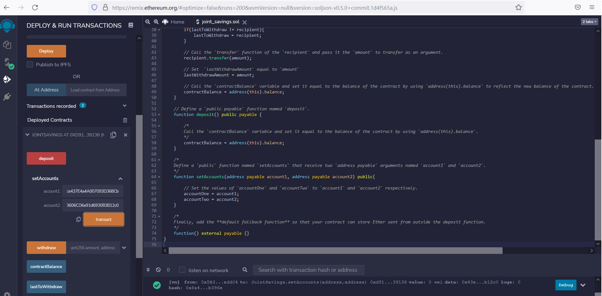
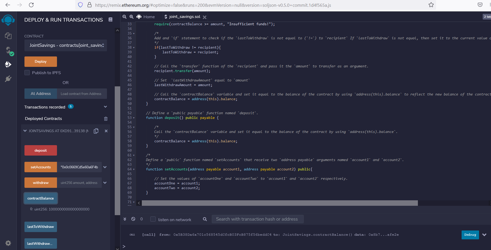
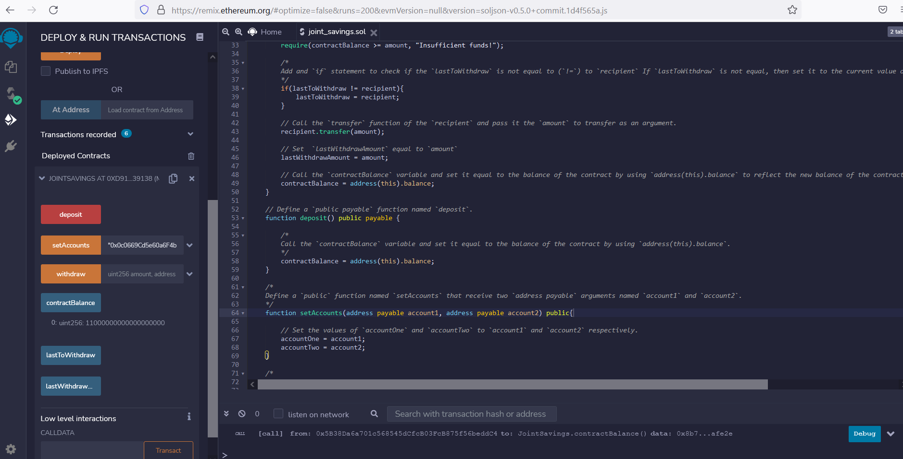
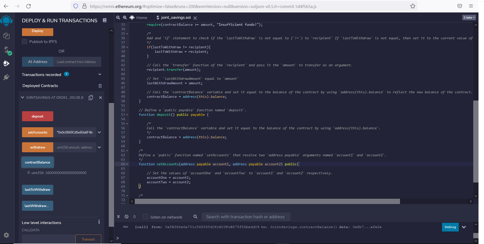
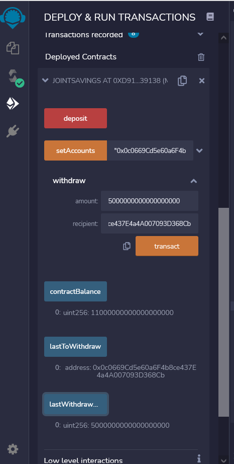
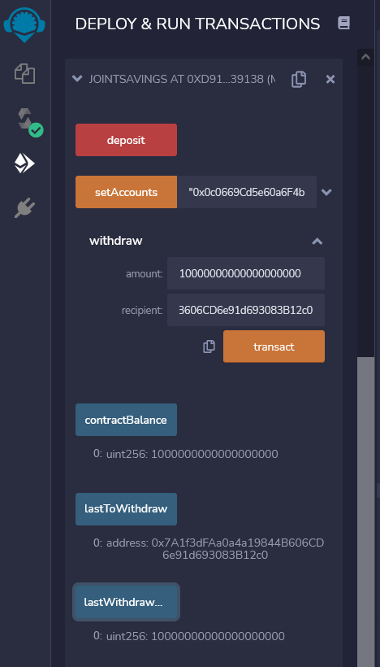

# Blockchain3

Solidity smart contract that models the operation of a joint savings account.
\
\
Step 1 - Setup the accounts:
 
\
\
Step 2a - Deposit 1 ether as wei:

\
\
Step 2b - Deposit 10 ether as wei:

\
\
Step 2c - Deposit 5 ether:

\
\
Step 3a - Withdraw 5 ether into account one.  Note that output of the `lastToWithdraw` and `lastWithdrawAmount` functions are also captured in this screenshot:

\
\
Step 3b - Withdraw 10 ether into account two.  Note that output of the `lastToWithdraw` and `lastWithdrawAmount` functions are also captured in this screenshot:

